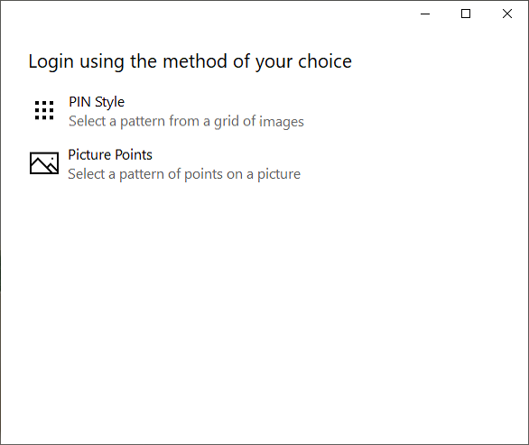

# EyegazeAuth
An authentication proof of concept application that allows a user to input a graphical password using their eyes. There are two password types implemented: PIN/grid and picture points. The grid password randomizes a 3x3 grid of images and the user selects the four with the correct labels (eg. cat, bike, tree, lamp). The picture points password allows the user to select four points on an image to act as their password.

Images
-----

